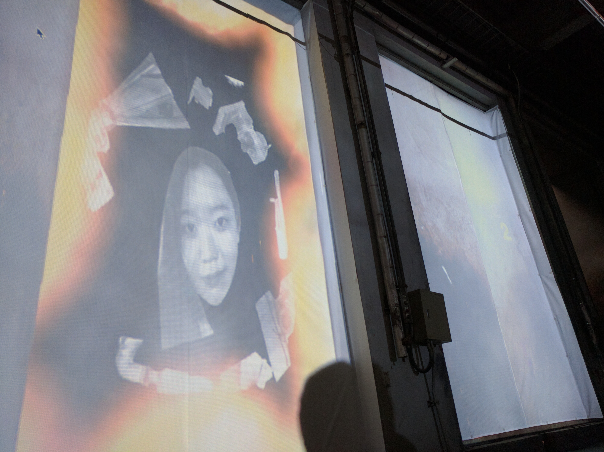
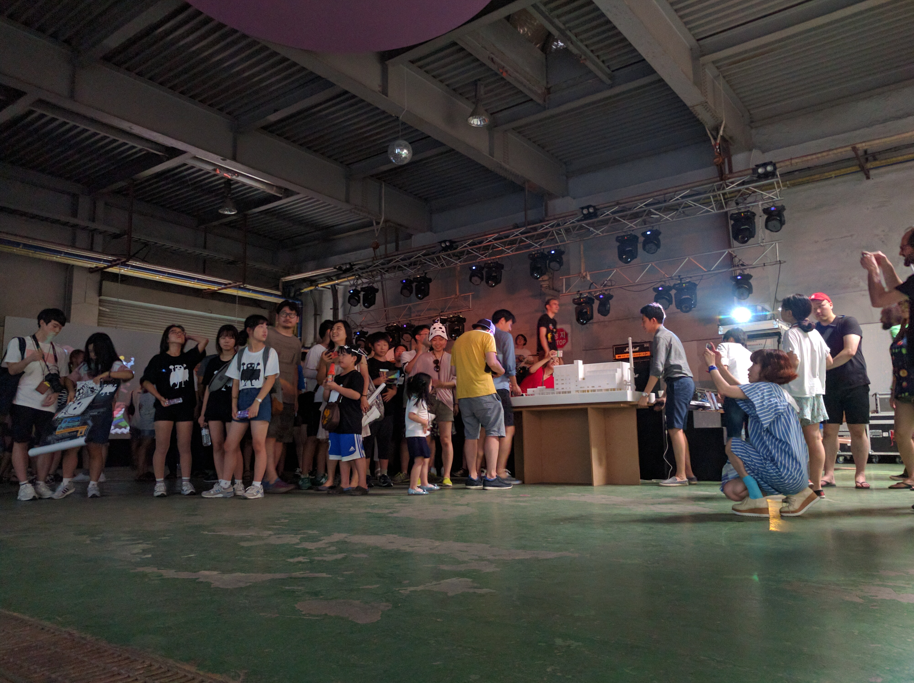

## Gates of the Beyond
####저 너머의 문

###### Description

Interactive video mapping installation. Open the gates and have a glimps.
With ghost's design elaborated by the participants of a 2 days workshop at the Bucheon Incinerator – Seoul, South Korea.

이틀간 부천소각장에서 진행된 애니메이션 디자인, 크리에이티브 코딩, 사운드 디자인 워크숍 참가자들이 탄생시킨 유령들을 인터랙티브 비디오 매핑 설치로 전시합니다.
문 너머에 있는 소각장 유령들을 만나보세요.

*This piece is a part of the Spectrum Syndicat Festival*

###### Credit

- Concept and design : Shobo
- Development : Bastien Didier
- Sound design : Gangpol

###### Gates of the  Beyond Gallery

